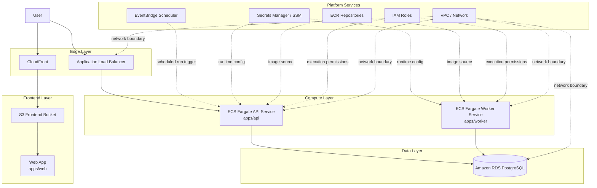
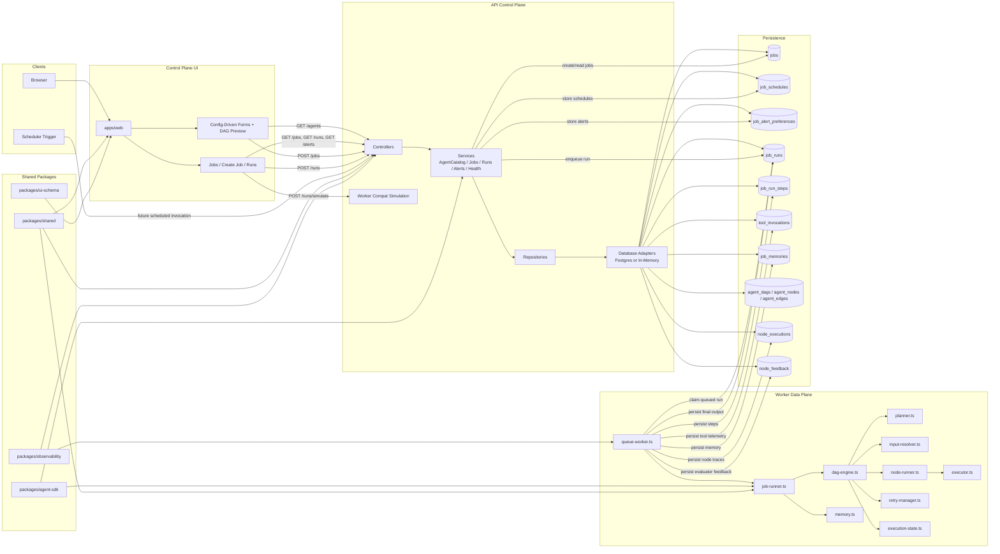

# Architecture Diagrams

This document complements [overview.md](/Users/travis/projects/agent-platform/docs/architecture/overview.md) with Mermaid diagrams for two different levels of abstraction:

- high-level infrastructure topology
- system design and execution-layer topology

The diagrams reflect the current repository structure and the intended AWS deployment model described in the existing architecture docs.

## Infrastructure High Level

### Infra Layers

- Edge: CloudFront serves the frontend path and the ALB fronts the API path.
- Frontend: `apps/web` is deployed as a static site to S3 behind CloudFront.
- Compute: `apps/api` and `apps/worker` are separate ECS Fargate services so the control plane and execution plane can scale independently.
- Data: PostgreSQL on RDS is the system of record for jobs, runs, schedules, telemetry, and memory.
- Platform: EventBridge Scheduler is the intended recurring trigger, while secrets, IAM, ECR, and network modules support runtime operations.

## System Design Level

### System Layers

- Client layer: browser users and future schedule triggers initiate control-plane actions.
- UI layer: `apps/web` renders agent definitions as forms, previews DAGs, and drives job/run actions.
- API layer: controllers, services, repositories, and database adapters own validation, persistence, queueing, and read models.
- Worker layer: the worker owns queue claiming, DAG execution, retry handling, telemetry capture, and memory generation.
- Shared layer: shared packages keep schemas, agent definitions, UI schema contracts, and observability consistent across apps.
- Persistence layer: PostgreSQL stores durable workflow state, DAG metadata, execution traces, and feedback artifacts.

## End-to-End Run Path

1. A user creates a job in `apps/web` from an agent definition and DAG preview.
2. `apps/api` validates the request and stores the job, schedule, and alert configuration.
3. A manual run or future scheduler trigger causes the API to insert a `job_runs` row with status `queued`.
4. `apps/worker` polls PostgreSQL, claims one queued run with `FOR UPDATE SKIP LOCKED`, and marks it `running`.
5. The worker resolves node inputs, executes the DAG, records node telemetry and evaluator feedback, writes memory, and updates the run to `succeeded` or `failed`.
